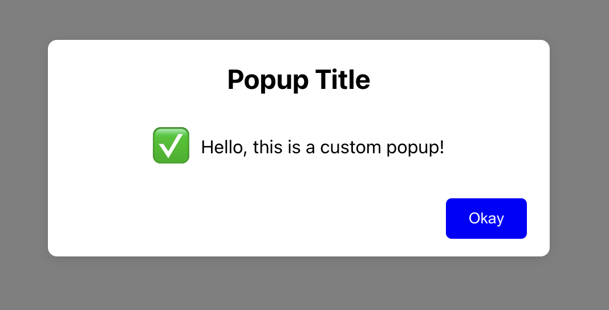

# Popup Component




## Overview

The Popup component is a customizable modal dialog for React applications. It allows you to display messages, titles, and emojis with an action button. The popup can be configured to close automatically when clicking outside of it.

## Features

- Customizable title, message, and emoji
- Customizable button text, color, and background color
- Configurable width, height, and background color of the popup
- Option to auto-close the popup on outside click
- Callback function after button click

## Installation

You can install the Popup component from npm:

```bash
npm i react-popup-card-npm
```

## Usage

1. **Import the Popup component:**
   ```jsx
   import { PopupCard }  from 'react-popup-card-npm';
   ```

2. **Use the Popup component in your application:**
   ```jsx
   const App = () => {
     return (
       <div>
         <PopupCard
           message="Your custom message"
           title="Your custom title"
           emoji="✅"
           buttonText="Close"
           width="400px"
           height="250px"
           bgColor="#f0f0f0"
           buttonColor="#fff"
           buttonBgColor="#007bff"
           autoCloseOnOutsideClick={true}
           afterNavigation={() => console.log('Button clicked!')}
         />
       </div>
     );
   };

   export default App;
   ```

## Props

| Prop                     | Type       | Default      | Description                                                                 |
|--------------------------|------------|--------------|-----------------------------------------------------------------------------|
| `message`                | `string`   | `"Default message"` | The message displayed in the popup.                                          |
| `title`                  | `string`   | `"Default title"`   | The title displayed at the top of the popup.                                 |
| `emoji`                  | `string`   | `"✅"`          | The emoji displayed to the left of the message.                              |
| `afterNavigation`        | `function` | `undefined`       | Callback function invoked after the button is clicked.                      |
| `buttonText`             | `string`   | `"OK"`        | The text displayed on the button.                                           |
| `width`                  | `string`   | `"300px"`     | The width of the popup.                                                     |
| `height`                 | `string`   | `"200px"`     | The height of the popup.                                                    |
| `bgColor`                | `string`   | `"#ffffff"`   | The background color of the popup.                                          |
| `buttonColor`            | `string`   | `"#fff"`      | The text color of the button.                                               |
| `buttonBgColor`          | `string`   | `"#0000ff"`   | The background color of the button.                                         |
| `autoCloseOnOutsideClick`| `boolean`  | `true`        | If true, the popup will close when clicking outside of it.                  |

## Development

To contribute to the development of this component:

1. **Clone the repository:**
   ```bash
   git clone https://github.com/madhurajayashanka/react-popup-card-npm.git
   ```

2. **Navigate to the project directory:**
   ```bash
   cd react-popup-card-npm
   ```

3. **Install the dependencies:**
   ```bash
   npm install
   ```

4. **Run the development server:**
   ```bash
   npm start
   ```

## License

This project is licensed under the MIT License. See the [LICENSE](LICENSE) file for more details.

